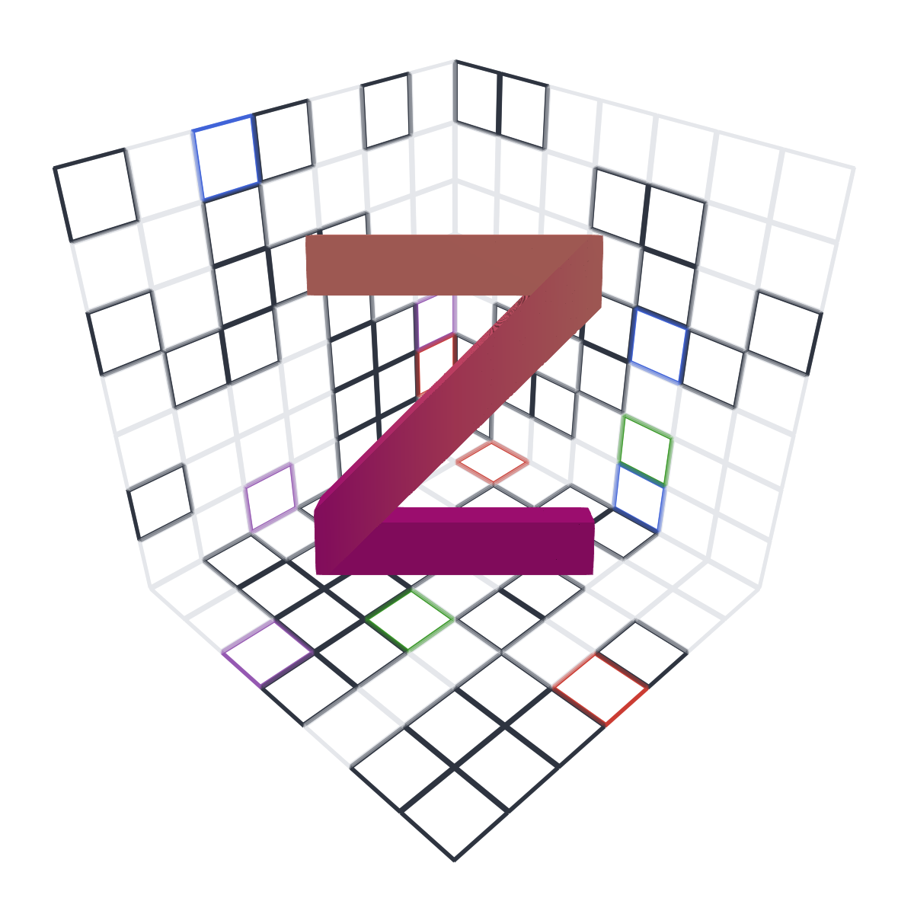

# Zarr.jl

<div align="center">

[![][docs-stable-img]][docs-stable-url]
[![][docs-dev-img]][docs-dev-url]
[![][ci-img]][ci-url]
[![][codecov-img]][codecov-url]
[![][julia-img]][julia-url]

</div>

</img>

`Zarr.jl` is a Julia package providing an implementation of chunked, compressed, N-dimensional arrays. [Zarr](https://zarr.readthedocs.io/en/stable/) is originally a Python package. In `Zarr.jl` we aim to implement the [zarr spec](https://zarr-specs.readthedocs.io/en/latest/specs.html).

## Package status

The package currently implements basic functionality for reading and writing zarr arrays. However, the package is under active development, since many compressors and backends supported by the python implementation are still missing.

## Repository layout

This monorepo contains the `Zarr` facade, `ZarrCore`, compressor packages
`ZarrBlosc`, `ZarrZlib`, and `ZarrZstd`, and storage packages `ZarrHTTP`,
`ZarrGCS`, `ZarrS3`, and `ZarrZip`. Each package is a top-level directory. The
facade source and tests live in `Zarr/src` and `Zarr/test`; documentation remains
in `docs`.

The root `Project.toml` is a Julia 1.12+ workspace used for monorepo
development. Individual packages support Julia 1.10+.

```bash
julia +1.12 --project=. -e 'using Pkg; Pkg.instantiate(; workspace=true)'
julia +1.12 --project=docs docs/make.jl
```

See [CONTRIBUTING.md](CONTRIBUTING.md) for the complete test commands. On Julia
1.11+, each project's `[sources]` entries resolve its local dependencies. On
Julia 1.10, develop sibling packages with explicit relative paths, for example
`Pkg.develop(path="../ZarrCore")`.

## Quick start

````julia
using Zarr
z1 = zcreate(Int, 10000,10000,path = "data/example.zarr",chunks=(1000, 1000))
z1[:] .= 42
z1[:,1] = 1:10000
z1[1,:] = 1:10000

z2 = zopen("data/example.zarr")
z2[1:10,1:10]
````

## Links
- https://discourse.julialang.org/t/a-julia-compatible-alternative-to-zarr/11842
- https://github.com/zarr-developers/zarr/issues/284
- https://zarr-specs.readthedocs.io/en/latest/specs.html

[docs-stable-img]: https://img.shields.io/badge/documentation-stable%20release-blue?style=round-square
[docs-stable-url]: https://juliaio.github.io/Zarr.jl/stable/

[docs-dev-img]: https://img.shields.io/badge/documentation-in%20development-orange?style=round-square
[docs-dev-url]: https://juliaio.github.io/Zarr.jl/dev/

[codecov-img]: https://codecov.io/gh/JuliaIO/Zarr.jl/branch/main/graph/badge.svg
[codecov-url]: https://codecov.io/gh/JuliaIO/Zarr.jl

[ci-img]: https://github.com/JuliaIO/Zarr.jl/actions/workflows/CI.yml/badge.svg?style=round-square
[ci-url]: https://github.com/JuliaIO/Zarr.jl/actions/workflows/CI.yml

[julia-img]: https://img.shields.io/badge/julia-v1.10+-blue.svg?style=round-square
[julia-url]: https://julialang.org/
